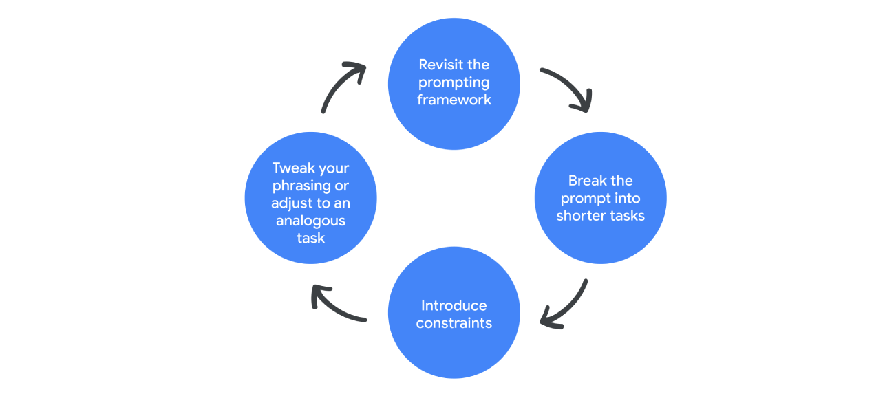

# Generate better outputs through iteration

Even with the prompting framework to guide you, sometimes you may still get an output that misses the mark. That’s what iteration is for: to clarify and refine your prompt to better direct a generative AI tool towards the result you had in mind. But some types of iteration have the potential to be especially effective in breaking through creative blocks during prompt design, leading gen AI to new solutions and sharper output.  

---

To iterate most effectively, prompt your AI tool in the same chat. That way, the tool can reference information you've provided it with in previous prompts and build on that knowledge. 

Here’s how iteration works in action. Consider this example prompt: 

Identify the latest developments in the restaurant industry.

It’s a simple prompt that only includes the task, and it might generate some broad insights, but chances are that you’ll need to iterate in order to get an output closer to what you want. You can try these four iteration methods to generate more useful outputs:

- Revisit the prompting framework: Make sure your prompt is clear about your desired task and includes a specific persona and format, plenty of context, and offers relevant references that help inform the output. Here’s an example: 

Create a bulleted list including the latest developments in the restaurant industry specific to urban areas that could impact the public reception of a dining experience using only ingredients native to the region. 

- Break the prompt into shorter sentences: Instead of packing everything into a complex and lengthy prompt, address each individual step in a separate prompt until you’ve accomplished everything:

Prompt one: Create a bulleted list including the latest developments in the restaurant industry.

Prompt two: Summarize the trends that would specifically impact restaurants in urban areas.

Prompt three: Write a pros and cons list on how those developments could impact the public reception of a dining experience using only ingredients native to the region.

- Tweak your phrasing or switch to an analogous task: Shift your language to explain what you mean in a different way. Or, try a different task that’s similar to what you’re trying to complete but different enough to trigger a new response. Here’s an example:

I’m starting a restaurant that will only include produce from within 50 miles. You’re a diner that lives in a major city and keeps up with the latest restaurant trends. Write a list of questions that I should consider before opening up the restaurant.

- Introduce constraints: Focus the gen AI tool’s output by adding constraints, or limitations, to your prompt. When you set boundaries for specific categories, lengths, formats, or other details in your prompt, you help the tool provide a more precise output. It’s like asking for a list of food recipes but specifying that the recipe should only use seasonal ingredients and take less than 30 minutes to prepare. Adding constraints can actually encourage more inventive, targeted results that better match your needs. Here’s an example:

Create a bulleted list including the latest developments in the restaurant industry specific to urban areas that could impact the public reception of a dining experience using only ingredients native to the region. This list should only include trends from cities with a population of more than 500,000 people, and should only include trends relevant to vegetarian and vegan restaurants.  

When providing guidance to a gen AI tool, it’s important to know the right direction to point it in. Whether you’re adhering more closely to the prompting framework, dividing a longer prompt into a few shorter ones, applying constraints, or re-phrasing your prompt as a similar task, iteration is the key to troubleshooting your prompt design and targeting the output you need.  
