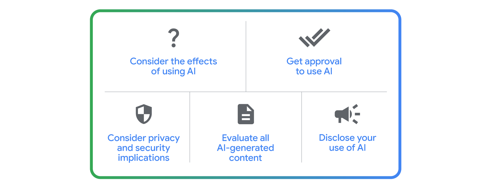

# Tips for responsible prompting

Sometimes a generative AI tool just won’t give you the output you need. There’s a reason for that. Gen AI tools are great at processing information and recognizing patterns but lack critical-thinking skills and human awareness. That’s why it’s important to learn how to prompt responsibly when using gen AI tools.

---

## Ethical risks and AI limitations

Gen AI tools aren’t perfect. Sometimes, their outputs can contain mistakes, bias, stereotypes, misleading information, and other harmful content. This is why a human-in-the-loop approach is so important—you must verify gen AI outputs before you use them. 

---

## Biases and stereotypes

Gen AI tools can sometimes reproduce existing biases about certain groups, like connecting specific activities with certain ages. This reinforces harmful stereotypes. To avoid these biases, like ageism, racism, or genderism in the output:

- **Specify diversity:** Add inclusive language to your prompt. For example, when prompting to create an image, you might input “a table of delicious foods.” Instead, you could write “a table of delicious foods from all over the world” or describe foods of a specific geography or cuisine. This will also produce a better output that you have more control over.

- **Challenge assumptions:** If a gen AI tool provides a biased response, point out the stereotype when you iterate on your prompt, and ask the tool to correct the bias. For example, when prompting for an image of delicious foods, you may receive an output with a lot of dishes from the same part of the world. You could point out the lack of diversity in the image and iterate for a more diverse visual. Maybe you notice that most of the foods in the image are Southeast Asian dishes. You could call attention to this, and ask the gen AI tool to include more food from West Africa or Northern Europe. Providing feedback may also help improve a gen AI tool’s future outputs.

---

## Hallucinations

When a gen AI tool provides an output with false information, it’s called a hallucination. Hallucinations can happen at any time and may happen when a gen AI tool gets vague or unclear instructions or when it generates an output about something it hasn’t been trained very well on. For example, a gen AI tool might miscalculate a math problem or include an incorrect ingredient for a recipe. To navigate hallucinations:

- **Fact-check and cross-reference:** Some gen AI tools have features that provide sources for where information was found. You can also fact-check an output by using a search engine to confirm information. You can even enlist the help of an expert if they’re available to you. Running a prompt through two or more resources helps you identify possible discrepancies in your output. 

- **Use clearer or more detailed language:** Sometimes, a gen AI tool will misunderstand something in your input, or if your input is wrong in some way, it could impact how a gen AI tool processes it. For example, if you wrote “Why is Toronto the capital of Canada?”, the gen AI tool may use your input as if it’s correct and give you a false history of Canada choosing Toronto—instead of Ottawa—as its government seat.

---

## Inconsistencies and relevance issues

While gen AI tools are evolving quickly, sometimes they will misinterpret your input or misunderstand the context of your request. For example, if you prompt a gen AI tool using an idiom or colloquial phrase like “think outside the box,” it might take this figurative phrase literally and suggest solutions that are about the outsides of boxes. To navigate inconsistencies and relevance issues:

- **Provide references:** This is where the References step of the prompting framework is really useful. Just be sure the references you provide are representative of your desired output. 

- **Provide more context:** You may also need to provide more context and detail or rephrase your prompt. Instead of writing “think outside the box,” you could iterate to tweak your phrasing and instead ask the gen AI tool to “consider unique, unconventional approaches” about the topic in question.

---

## Responsible prompting and workplace considerations

Gen AI tools aren’t going to be right for every situation, which is why it’s important to consider a few things before designing a prompt to help with a work-related task.

Think about the problem you’re using a gen AI tool to help you solve. Does it align with your goals and obligations to your coworkers and clients? What are your company’s policies around the use of AI? Are you potentially putting sensitive data at risk? Is the gen AI tool you’re using a private internal tool or a public one? 

Always keep the human-in-the-loop approach at the forefront of how you use AI. That means a human verifies a gen AI tool’s outputs before they are used anywhere, whether that’s at home, at work, or somewhere else. 

---

## Checklist for using gen AI responsibly at work

- **Consider the effects of using AI** to solve your problem or task and always use your best judgment and critical thinking skills. Before using AI, ask yourself whether or not AI is right for the task you’re working on. For example, would a gen AI tool reinforce or uphold biases that may cause damage to a particular group of people? 

- **Get approval to use AI** from the appropriate people at your company before you use gen AI on projects or with clients.

- **Consider the privacy and security implications** of the gen AI tool you’re using, whether it’s a public or proprietary tool. You can also check if your company has an enterprise version of a gen AI tool that allows you to put it to work on other use cases.

- **Evaluate all AI-generated content** before you incorporate it into your work or share it with anyone.

- **Disclose your use of AI** to your team and clients, and be transparent about how you use it.

---

## When in doubt, clear the memory

Periodically clearing the memory of a gen AI tool is another great way to improve the accuracy and relevance of its outputs. Clearing the memory gives the tool a fresh start, allowing it to approach new prompts with a clean slate. Other benefits of clearing memory include: 

- **Protecting privacy:** Removes potentially sensitive information from previous interactions.

- **Avoiding bias:** Prevents the tool from carrying forward assumptions or stereotypes from earlier prompts.

- **Reducing confusion:** Ensures the tool focuses solely on the current task and context.

- **Troubleshooting:** Refreshes the tool when it seems stuck or is producing unexpected results. 

Different tools have different instructions for clearing memory, so be sure to check the settings for instructions to learn how.

One note when it comes to clearing memory: some tools automatically clear the memory each time you open it and therefore don’t remember what you previously asked.

AI is a powerful tool—which is why it’s important to use it carefully and responsibly. That means being mindful of ethical risks, acknowledging AI’s limitations, and accounting for biases. The best results come from a combination of human ingenuity and a gen AI tool’s capabilities. So keep asking insightful questions, refining your prompts, and above all, using your critical-thinking skills. That way, you contribute to a future where AI serves everyone responsibly and ethically.
