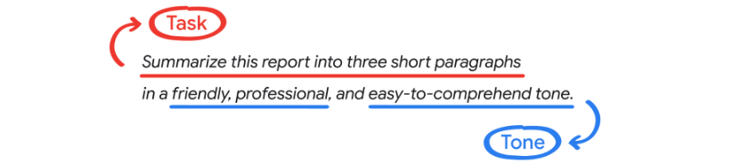

# Prompt with personality: Match gen AI to your writing style

---

## How gen AI tools approach tone and style

Ever noticed how some AI-generated content can sound a bit robotic, while other times it feels like you’re chatting with a friend or professor? The reason for that is in how gen AI tools handle tone and style. The tools do this in a few different ways, but this reading will focus on just one.  

---

## Contextual understanding

Think of a gen AI chatbot trained on a massive dataset of everyday conversations. When you ask "What's up?" it understands that you're probably asking how it’s doing. It recognizes this common greeting from its training data. Most likely, it will respond appropriately with something like "Not much, how about you?"

That’s thanks to contextual understanding, which allows a gen AI tool to interpret information in a specific setting and use that comprehension to generate an output. This helps the tool:

- Identify audiences.
- Recognize linguistic cues, like a question mark at the end of a sentence.
- Learn language from provided references.
- Adapt to your preferences.
- Stay consistent in the language it uses.
- Understand inputs and generate outputs in the tone and style you provide it.

---

## Strategies for tone and style in prompting

When it comes to matching tone and style, a gen AI tool’s contextual understanding is a key ingredient—but it doesn't make up the whole recipe. That’s where you come in. Here are a few ways to adjust your prompts to help fine-tune tone and style. 

**Specify your tone and style**
When using the **prompting framework**, enter your desired tone and style within the **task**. 

Maybe you have a report you want summarized for a colleague or manager. For example, you could write:  

> Summarize this report into three short paragraphs.

Instead, specify the tone in your prompt:  

> Summarize this report into three short paragraphs in a friendly, professional, and easy-to-comprehend tone.

Your inputs will continue to impact your outputs as you iterate in the same conversation thread, so being explicit and detailed from the initial setup is important. Bottom line: Don't leave things to interpretation. The more specific you get about the tone you’re after, the better the tool can match your expectations.

For example, specify “witty banter” instead of “humorous,” or “like talking to a friend” instead of “casual.” Here are some other examples of tone you could include in your prompts, with more specific alternatives:

- Academic, or “scholarly and in-depth, like a professor”
- Persuasive, or “compelling and convincing”
- Sarcastic, or “dryly funny, like a wry comedian”
- Inspirational, or “motivating and uplifting”
- Simple, or “like you’re a kindergarten teacher explaining this to their students”

Finally, you might want to add constraints in your first prompt to ensure the language stays on track, such as “avoid using jargon that would be confusing to people who are unfamiliar with the subject.”  

**Provide tone and style references**
You can specify your tone and style even further by providing a reference for the gen AI tool to work from.  

Suppose you’re prompting a gen AI tool to help you write a description for a new line of products. You should use specific descriptors of the tone and style you’re interested in based on the audience of the products.  

For example, you might write:  

> Help me draft a description for a new line of rock climbing apparel. The target audience is young outdoor enthusiasts and climbers. I want the description to speak to the audience's desire for durable, attractive rock climbing apparel for indoor and outdoor climbing. Keep the language upbeat, informative, and inspiring. Imagine you're talking to a friend who's an avid rock climber.  

This prompt will work as is, but you could get even more specific about the tone and style you want by providing a reference in your initial prompt rather than waiting to see the output and deciding if it needs one. In that case, you’d just add something like this to the end of your prompt:  

> Consider the tone and style of interviews with history’s most renowned climbers as a reference.

If you’d rather try your luck, you can generate the output without a reference, edit it to your liking, and then use that as a reference for the gen AI tool in your next iteration.

**Iterate on tone and style**
If your initial output doesn’t feel quite right, that’s a good time to get more specific by *iterating* on your prompt and adding more details and directions.

Consider the example above. Maybe the message is too bland or the language feels like it won’t appeal to the climbing community. To iterate, you could inject more of the voice you want into the prompt, explain the exact type of apparel you’re selling, add more tone descriptors, and emphasize an emotional connection to the sport of climbing, like this:

> I need this product line description to speak to the heart of young climbers of all kinds. I want to evoke their passion for pushing limits both indoors and out. The shirts, jackets, pants, shorts, tanks, and carabiners enable climbers to express their personal style without sacrificing quality, comfort, or durability, ensuring they look sharp and climb smart. Channel the spirit of climbing legends, and inspire them to reach new heights. Make the language less cheeky and more reverent of the sport.

Remember, **Always Be Iterating**! Continuing to refine your prompt provides the gen AI tool with more information so you can get closer to a final output that suits your needs.  

---

## Why prompting for tone and style matters

Whether you’re crafting a professional email, a fun social media post, or a persuasive essay, the right tone and style can make all the difference in how your message is communicated and received. When you specify voice and tone in a prompt, a gen AI tool will use contextual understanding to figure out what you mean, and match outputs to the voice you’re hoping for. If it’s not what you want, you can always provide references and iterate. To get the best results from a gen AI tool, treat it like you’re giving directions to an actor—the clearer your instructions, the better the actor can embody the character you’re envisioning.  

Put briefly, nuance matters! And the more you teach gen AI tools about it, the more helpful they can be. So get specific with your prompts, and narrow in on how you want the outputs to sound. By doing so, you equip gen AI tools to serve you better, whether as an individual or within the unique context of your workplace.
